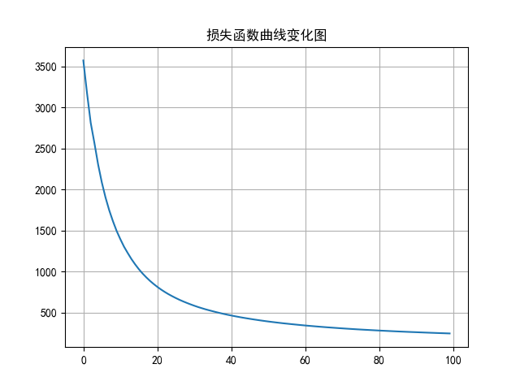
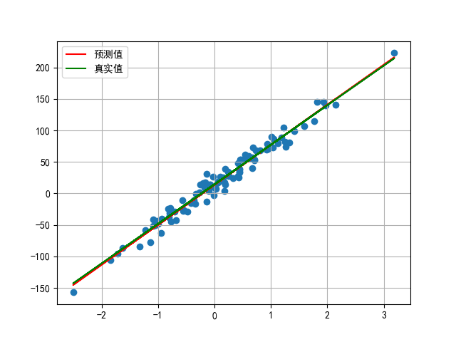

# 张量的操作与基本运算
## 1. 张量和Numpy之间相互转换

### 张量转换为numpy数组
```python
data_tensor.numpy()
data_tensor.numpy().copy()
```
### numpy转换为张量
```python
torch.from_numpy(data_numpy)
torch.tensor(data_numpy)
```
### 标量张量和数字转换
```python
tensor.item()
```
## 2. 张量的基本运算
### 加法
各元素相加, 如另一元素为数字, 则将该数字视为同形状且值均为该数字的张量.
```python
add_result = tensor1 + tensor2
add_result_num = tensor1 + number
add_result_num2 = tensor1.add(number)

# 修改原数据
tensor_inplace.add_(5)
tensor_inplace += 5
```

### 减法
各元素相减, 如另一元素为数字, 则将该数字视为同形状且值均为该数字的张量.
```python
sub_result = tensor1 - tensor2
sub_result_num = tensor1 - number
sub_result_num2 = tensor1.sub(number)

# 修改原数据
tensor_inplace.sub_(5)
tensor_inplace -= 5
```

### 乘法
各元素相乘, 如另一元素为数字, 则将该数字视为同形状且值均为该数字的张量.
```python
mul_result = tensor1 * tensor2
mul_result_num = tensor1 * number
mul_result_num2 = tensor1.mul(number)

# 修改原数据
tensor_inplace.mul_(5)
tensor_inplace *= 5
```

### 除法
各元素相除, 如另一元素为数字, 则将该数字视为同形状且值均为该数字的张量.
```python
div_result = tensor1 / tensor2
div_result_num = tensor1 / number
div_result_num2 = tensor1.div(number)

# 修改原数据
tensor_inplace.div_(5)
tensor_inplace /= 5

# 也可用整除运算符
div_result_num = tensor1 // number
```

### 相反
各元素取反
```python
neg_result = -tensor1
neg_result2 = torch.neg(tensor1)

# 修改原数据
tensor_inplace.neg_()
```

## 3. 张量的点乘和矩阵乘法
### 点乘
点乘 (Hadamard)指的是相同形状的张量对应位置的元素相乘, 使用 `mul` 和运算符 `*` 实现. 

设有矩阵 $\mathbf{A}, \mathbf{B} \in \mathbb{R}^{2 \times 2}$ 如下: 

$$
\mathbf{A}=\begin{bmatrix} 1&2\\ 3&4 \end{bmatrix},
\mathbf{B}=\begin{bmatrix} 5&6\\ 7&8 \end{bmatrix}
$$
则 $\mathbf{A}, \mathbf{B}$ 的点积为
$$
\mathbf{A}\circ \mathbf{B} = 
\begin{bmatrix} 1\times5&2\times6\\ 3\times7&4\times8 \end{bmatrix}
=\begin{bmatrix} 5&12\\ 21&32 \end{bmatrix}
$$
```python
hadamard_result1 = tensor1 * tensor2
hadamard_result2 = torch.mul(tensor1, tensor2)
```

### 矩阵乘法 

设有矩阵 $\mathbf{A} \in \mathbb{R}^{n \times m}, \mathbf{B} \in \mathbb{R}^{m \times p}$, 则 $\mathbf{A}\mathbf{B}\in \mathbb{R}^{n \times p}$

- 运算符 `@` 用于进行两个矩阵的乘积运算
- `torch.matmul`对进行乘积运算的两矩阵形状没有限定. 对于输入的shape不同的张量, 对应的最后几个维度必须符合矩阵运算规则
- `dot()` 只用于一维张量

```python
matmul_result1 = tensor1 @ tensor2
matmul_result2 = torch.matmul(tensor1, tensor2)

# dot() 只用于一维张量
tensor3 = torch.tensor([1, 2, 3])
tensor4 = torch.tensor([4, 5, 6])
dot_result = tensor3.dot(tensor4)
```

## 4. 张量运算函数
### 需要维度参数的函数
```python
# dim = 0 表示列 dim = 1 表示行
torch.sum(tensor, dim=None) # 求和
torch.mean(tensor, dim=None) # 求平均, 需要张量内元素类型为 float
torch.max(tensor, dim=None) # 最大值
torch.min(tensor, dim=None) # 最小值
```

### 不需要维度参数的函数
```python
torch.pow(tensor, exponent) # 求幂 等价于 ** 运算符
torch.sqrt(tensor) # 开平方
torch.exp(tensor) # 指数, e^x 其中x为张量中的元素 
torch.log(tensor) # 各元素的自然对数
torch.log2(tensor) # 各元素的 log2 对数
torch.log10(tensor)  # 各元素的 log10 对数
```

## 5. 张量索引操作
### 简单索引
```python
tensor[row, col]
tensor[row_index, :]
tensor[:, col_index]
```
### 列表索引
```python
tensor[[row_indices], [col_indices]]
# 获取第0, 1行，第1, 2列的四个元素
tensor[[[0], [1]], [1, 2]]
```
### 范围索引
```python
tensor[:3, :2]
# 获取所有奇数行偶数列的数据
tensor[::2, 1::2]
```
### 布尔索引
```python
#第二列中大于5的元素
tensor[tensor[:, 2] > 5, 2]
#第二列中大于5的元素所在行
tensor[tensor[:, 2] > 5]
```
### 多维索引
```python
# 第0维的第1个数据
tensor_3d[0, :, :]
```

## 6. 张量的形状操作
### `reshape()`
不改变张量内容的情况下改变形状, 改变前后元素数目相同. 
```python
tensor.reshape(size)
```
### `squeeze()` 与 `unsqueeze()`
`squeeze()` 删除所有为 1 的维度.  
`unsqueeze()` 在指定轴上添加一个 (1) 维度. 
```python
tensor.squeeze()
tensor.unsqueeze(dim)
```
### `transpose()` 与 `permute()`
`transpose()`: 一次交换两个维度  
`permute()`: 一次交换任意维度
```python
tensor.transpose(dim0, dim1)
tensor.permute([indexs of original tensor])
```

### `view()`, `contiguous()`, `is_contiguous()`
`view` 函数也可以用于修改张量的形状, 只能用于修改 **连续** 的张量. 
在PyTorch中, 有些张量的底层数据在内存中的存储顺序与其在张量中的逻辑顺序不一致. `view` 函数无法对这样的张量进行变形处理.  
例如: 一个张量经过了 `transpose` 或者 `permute` 函数的处理之后, 就无法使用 `view`函数进行形状操作.   
`contiguous()` 可以将张量转换为连续的. 
`is_contiguous()` 可以判断张量是否为连续的. 
```python
tensor.view(New Shape)
tensor.contiguous()
tensor.is_contiguous()
```

## 7. 张量拼接操作
`torch.cat()`函数可以将多个张量根据指定的维度拼接起来, 不改变维度数.  
`torch.stack()`函数会在一个新的维度上连接一系列张量，这会增加一个新维度, 并且所有输入张量的形状必须完全相同. 
```python
torch.cat((tensor1, tensor2), dim=0)
torch.stack((tensor1, tensor2), dim=0)
```

## 8. 自动微分模块
对损失函数求导, 结合反向传播, 更新权重参数 $\boldsymbol{w}, \boldsymbol{b}$

$$
\boldsymbol{z}=\boldsymbol{w}^{\mathrm{T}}\mathbf{X}+\boldsymbol{b}
$$

$$
f_\mathrm{loss} = \left \| \boldsymbol{y}-\boldsymbol{z} \right \|_2 
$$

$$
\boldsymbol{w}^{(k+1)}=\boldsymbol{w}^{(k)}-\alpha \frac{\partial f_\mathrm{loss}}{\partial \boldsymbol{w}} , \boldsymbol{b}^{(k+1)}=\boldsymbol{b}^{(k)}-\alpha \frac{\partial f_\mathrm{loss}}{\partial \boldsymbol{b}} 
$$

```python
# 定义可以自动微分的张量
w = torch.tensor(10, requires_grad=True, dtype=torch.float)

loss.backward() # 自动累加到 w.grad

# 梯度下降法中需要注意清零 grad
if w.grad is not None:
    w.grad.zero_()

# 设置自动微分的张量想转换为numpy数组使用detach()
numpy_diff_detach = tensor_diff.detach().numpy()
```

## 9. 线性回归案例
使用 `nn.MSELoss()` 代替平方损失函数  
使用 `data.DataLoader` 代替数据加载器  
使用 `optim.SGD` 代替优化器  
使用 `nn.Linear` 代替假设函数  

详细代码参见 `10_Linear_regression.py`, 运行结果如下:



