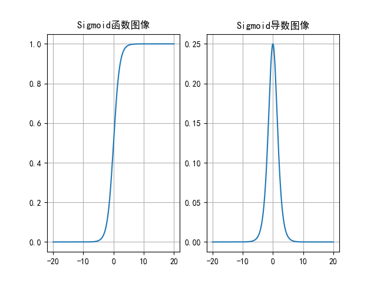
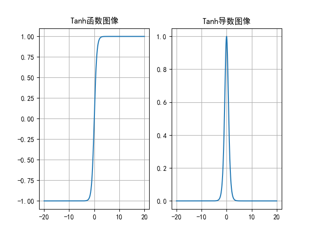
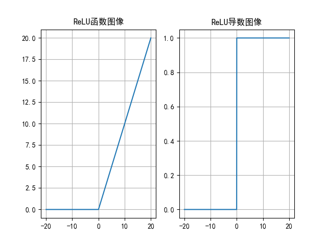
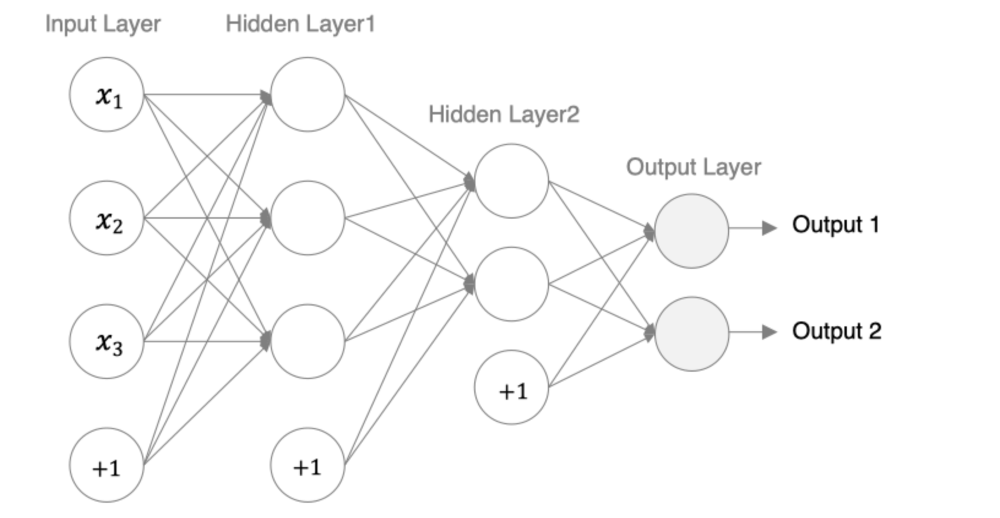

# ANN 人工神经网络

## 1. 神经网络基础
人工神经网络（Artificial Neural Network， 简写为**ANN**）也简称为神经网络（NN），是一种模仿生物神经网络结构和功能的**计算模型**。它由多个互相连接的人工神经元（也称为节点）构成，可以用于处理和学习复杂的数据模式，尤其适合解决非线性问题。人工神经网络是机器学习中的一个重要模型，尤其在深度学习领域中得到了广泛应用。接收数据是二维的

###  如何构建神经网络
神经网络是由多个神经元组成，构建神经网络就是在构建神经元。

神经网络中信息只向一个方向移动，即从输入节点向前移动，通过隐藏节点，再向输出节点移动。其中的基本部分是:

1. **输入层（Input Layer）**: 即输入x的那一层（如图像、文本、声音等）。每个输入特征对应一个神经元。输入层将数据传递给下一层的神经元。
2. **输出层（Output Layer）**: 即输出y的那一层。输出层的神经元根据网络的任务（回归、分类等）生成最终的预测结果。
3. **隐藏层（Hidden Layers）**: 输入层和输出层之间都是隐藏层，神经网络的“深度”通常由隐藏层的数量决定。隐藏层的神经元通过加权和激活函数处理输入，并将结果传递到下一层。

特点: 
- 同一层的神经元之间没有连接
- 第N层的每个神经元和第N-1层的所有神经元相连（这就是Fully Connected的含义)，这就是**全连接神经网络（FCNN）**
- 全连接神经网络接收的样本数据是**二维的**，数据在每一层之间需要以二维的形式传递
- 第N-1层神经元的输出就是第N层神经元的输入
- 每个连接都有一个权重值（ $\boldsymbol{w}$ 系数和 $\boldsymbol{b}$ 系数）

###  神经网络内部状态值和激活值
每一个神经元工作时，**前向传播**会产生两个值，**内部状态值（加权求和值）**和**激活值**；**反向传播**时会产生**激活值梯度**和**内部状态值梯度**。

**内部状态值** :神经元或隐藏单元的内部存储值，它反映了当前神经元接收到的输入、历史信息以及网络内部的权重计算结果。
$$\boldsymbol{z} = \mathbf{W}\boldsymbol{x} + \boldsymbol{b}$$

**激活值** : 通过激活函数（如 ReLU、Sigmoid、Tanh）对内部状态值进行非线性变换后得到的结果。激活值决定了当前神经元的输出。
$$a = f(\boldsymbol{z})$$

## 2. 激活函数

激活函数用于对每层的输出数据进行变换，进而为整个网络注入了 **非线性因素**。此时，神经网络就可以
拟合各种曲线。

1.没有引入非线性因素的网络等价于使用一个线性模型来拟合  
2.通过给网络输出增加激活函数，实现引入非线性因素，使得网络模型可以逼近任意函数，提升网络对
复杂问题的拟合能力.

### sigmoid

公式: 
$$\frac{1}{1+e^{-x}}$$

导数:
$$f'(x) = \frac{1}{1+e^{-x}}\left(1-\frac{1}{1+e^{-x}}\right)=f(x)(1-f(x))$$

在 $[-6,6]$ 有效果， 在$[-3, 3]$ 效果明显.导数结果在 $[0, 0.25]$ 之间, 值分布于 $[-6, 6]$之间.  



sigmoid函数可以将任意的输入映射到(0，1)之间，当输入的值大致在$<6$或者$>6$时，意味着输入任何值得
到的激活值都是差不多的，这样会丢失部分的信息。  

一般来说，sigmoid网络在 **5层之内** 就会产生 **梯度消失** 现象。而且，该激活函数并不是以0为中心（以0.5为中心）的，所以在
实践中这种激活函数使用的很少。sigmoid函数一般只用于二分类的 **输出层**。

### Tanh

公式: 
$$\frac{1- e^{-2x}}{1+e^{-2x}}$$

导数:
$$f'(x) = 1-f^2(x)$$

在 $[-3,3]$ 有效果， 在$[-1, 1]$ 效果明显  


Tanh函数将输入映射到（1，1）之间，图像以0为中心，在0点对称，当输入大概$<-3$
或者$>3$时将被映射为$-1$或者$1$。其导数值范围（0，1），当输入的值大概$<-3$或者$>3$
时，其导数近似0。  
与Sigmoid相比，它是以0为中心的，且梯度相对于Sigmoid大，使得其 **收敛速度要比
Sigmoid快**，减少迭代次数。然而，从图中可以看出，Tanh两侧的导数也为0，同样会造
成梯度消失。  
若使用时可在 **隐藏层** 使用tanh函数，在 **输出层** 使用sigmoid函数。

### ReLU
默认情况下， ReLU只考虑正样本。  
公式: 
$$f(x) = \max (0,x)$$

导数:  
$$f'(x) = 0\ or\ 1$$



ReLU激活函数将小于0的值映射为0，而大于0的值则保持不变，它更加重视正信号，
而忽略负信号，这种激活函数运算更为简单，能够提高模型的训练效率。  
当 $x<O$ 时，ReLU导数为0，而当 $x>O$ 时，则不存在饱和问题。
所以，ReLU能够在 $x>O$ 时保持梯度不衰减，从而缓解梯度消失问题。
然而，随着训练的推进，部分输入会落入小于0区域，导致对应权重无法更新。
这种现象被称为“神经元死亡”  
ReLU是目前最常用的激活函数。

- 与sigmoid相比，ReLU的优势是： 采用sigmoid函数，计算量大（指数运算），反向传播求误差梯度时，计算量相对大，而采用
Relu激活函数，整个过程的计算量节省很多。
- sigmoid函数反向传播时，很容易就会出现梯度
消失的情况，从而无法完成深层网络的训练。Relu会使一部分神经元的输出为0，这样就造成
了网络的稀疏性，并且减少了参数的相互依存关系，缓解了过拟合问题的发生。

### softmax
softmax用于多分类过程中，它是二分类函数sigmoid在多分类上的推广，目的是将多分类的结果以概率的形式展现出来。
公式: 
$$f(x) = softmax(z_i) \frac{e^{z_i}}{\sum_j e^{z_j}}$$

### 激活函数的选择
**隐藏层** 常用的激活函数(从左到右优先级递减)
ReLU, LeakyReLU, PReLU, Tanh, Sigmoid(少用)
如果你使用了ReLU 需要注意Dead ReLU问题, 避免出现0梯度而导致过多的神经元死亡

**输出层** 常用的激活函数
二分类选择 sigmoid  
多分类选择 Softmax  
回归问题选择 identity

## 3. 参数初始化

我们在构建网络之后，网络中的参数是需要初始化的。我们需要初始化的参数主要有**权重**和**偏置**，**偏置一般初始化为0即可**，而对权重的初始化则会更加重要。

### 参数初始化的作用

- **防止梯度消失或爆炸**：初始权重值过大或过小会导致梯度在反向传播中指数级增大或缩小。
- **提高收敛速度**：合理的初始化使得网络的激活值分布适中，有助于梯度高效更新。
- **保持对称性破除**：权重的初始化需要打破对称性，否则网络的学习能力会受到限制。


### 无法打破对称性的初始化
- 全0初始化(记忆)
    `nn.init.zeros_()`  
- 全1初始化
    `nn.init.ones_()`  
- 固定值初始化
    `nn.init.constant_()`  

### 可以打破对称性的初始化
- 随机初始化
    `nn.init.uniform_()`
    `nn.init.normal_()`

- kaiming 初始化(+ ReLU) 专为ReLU和其变体设计，考虑到ReLU激活函数的特性，对输入维度进行缩放(记忆)  
    正态分布的 he初始化
        `nn.init.kaiming_normal_()`  
    均匀分布的 he初始化
        `nn.init.kaiming_uniform_()`  
- xavier初始化  适用于Sigmoid、Tanh 等激活函数，解决梯度消失问题(记忆)  
    正态分布的 xavier初始化
        `nn.init.xavier_normal_()`  
    均匀分布的 xavier初始化
        `nn.init.xavier_uniform_()`

激活函数 **ReLU 及其系列**，优先 kaiming 初始化  
激活函数 **非 ReLU**，优先 xavier初始化

若为 **浅层网络**，可以考虑随机初始化  
若为 **深层网络**，kaiming 初始化和xavier初始化

## 4. 神经网络搭建和参数计算
在pytorch中定义深度神经网络其实就是层堆叠的过程，继承自nn.Module，实现两个方法：

- `__init__`方法中定义网络中的层结构，主要是全连接层，并进行初始化
- forward方法，在调用神经网络模型对象的时候，底层会自动调用该函数。该函数中为初始化定义的layer传入数据，进行前向传播等。
  
深度学习的4个步骤：
1. 准备数据.
2. 搭建神经网络
3. 模型训练
4. 模型测试

神经网络搭建流程：  
1. 定义一个类，继承:`nn.Module`。  
2. 在`__init__()`方法中，搭建神经网络。  
3. 在`forward()`方法中，完成前向传播。  



- 第1个隐藏层：权重初始化采用标准化的xavier初始化 激活函数使用sigmoid
- 第2个隐藏层：权重初始化采用标准化的He初始化 激活函数采用relu
- out输出层线性层 假若多分类，采用softmax做数据归一化

### 构造神经网络模型代码

```python
import torch
import torch.nn as nn
from torchsummary import summary  # 计算模型参数,查看模型结构, pip install torchsummary -i https://mirrors.aliyun.com/pypi/simple/


# 创建神经网络模型类
class Model(nn.Module):
    # 初始化属性值
    def __init__(self):
        # 调用父类的初始化属性值，确保nn.Module的初始化代码能够正确执行
        super(Model, self).__init__()
        # 创建第一个隐藏层模型, 3个输入特征,3个输出特征
        self.linear1 = nn.Linear(3, 3)
        # 初始化权重
        nn.init.xavier_normal_(self.linear1.weight)
        nn.init.zeros_(self.linear1.bias)
        # 创建第二个隐藏层模型, 3个输入特征(上一层的输出特征),2个输出特征
        self.linear2 = nn.Linear(3, 2)
        # 初始化权重
        nn.init.kaiming_normal_(self.linear2.weight, nonlinearity='relu')
        nn.init.zeros_(self.linear2.bias)
        # 创建输出层模型
        self.out = nn.Linear(2, 2)

	# 创建前向传播方法, 调用神经网络模型对象时自动执行forward()方法
    def forward(self, x):
        # 数据经过第一个线性层
        x = self.linear1(x)
        # 使用sigmoid激活函数
        x = torch.sigmoid(x)

        # 数据经过第二个线性层
        x = self.linear2(x)
        # 使用relu激活函数
        x = torch.relu(x)

        # 数据经过输出层
        x = self.out(x)
        # 使用softmax激活函数
        # dim=-1:每一维度行数据相加为1
        x = torch.softmax(x, dim=-1)

        return x
```

### 训练神经网络模型代码

```python
# 创建构造模型函数
def train():
    # 实例化model对象
    my_model = Model()

    # 随机产生数据
    my_data = torch.randn(5, 3)
    print("my_data-->", my_data)
    print("my_data shape", my_data.shape)

    # 数据经过神经网络模型训练
    output = my_model(my_data)
    print("output-->", output)
    print("output shape-->", output.shape)

    # 计算模型参数
    # 计算每层每个神经元的w和b个数总和
    print("======计算模型参数======")
    summary(my_model, input_size=(3,), batch_size=5)
    
    # 查看模型参数
    print("======查看模型参数w和b======")
    for name, parameter in my_model.named_parameters():
        print(name, parameter)


if __name__ == '__main__':
    train()
```

###  查看模型参数

通常继承nn.Module，撰写自己的网络层。它强大的封装不需要我们定义可学习的参数（比如卷积核的权重和偏置参数）。

查看封装好的可学习的网络参数

  - `模块实例名.name_parameters()`,会分别返回`name`和`parameter`

  ```python
  # 实例化model对象
  mymodel = Model()
  
  # 查看网络参数
  for name, parameter in mymodel.named_parameters():
      # print('name--->', name)
      # print('parameter--->', parameter)
      print(name, parameter)
  ```

### 模型参数的计算

以第一个隐层为例：该隐层有3个神经元，每个神经元的参数为：4个（w1,w2,w3,b1），所以一共用3x4=12个参数。 


  ```python
  ----------------------------------------------------------------
          Layer (type)               Output Shape         Param #
  ================================================================
              Linear-1                     [5, 3]              12
              Linear-2                     [5, 2]               8
              Linear-3                     [5, 2]               6
  ================================================================
  Total params: 26
  Trainable params: 26
  Non-trainable params: 0
  ----------------------------------------------------------------
  Input size (MB): 0.00
  Forward/backward pass size (MB): 0.00
  Params size (MB): 0.00
  Estimated Total Size (MB): 0.00
  ----------------------------------------------------------------
  ```

## 5. 损失函数
在深度学习中, 损失函数是用来 **衡量模型参数质量的函数** , 衡量的方式 **是比较网络输出（预测值）和真实输出（真实值）的差异。**
模型通过最小化损失函数的值来调整参数，使其输出更接近真实值。

**损失函数作用：**
- **评估性能**：反映模型预测结果与目标值的匹配程度。
- **指导优化**：通过梯度下降等算法最小化损失函数，优化模型参数。

### 分类任务损失函数

#### 多分类任务损失函数

在多分类任务通常使用softmax将logits转换为概率的形式，所以多分类的交叉熵损失也叫做**softmax损失**，它的计算方法是：

$$\mathcal{L}=-\sum_{i=1}^n \mathbf{y}_i \log(S(f_{\theta}(\mathbf{x}_i)))$$

其中:
- $\mathbf{y}_i$ 是样本 $\mathbf{x}_i$ 属于某一个类别的真实概率
- 而 $f(\mathbf{x})$ 是样本属于某一类别的预测分数, 即加权求和
- $S$ 是 softmax 激活函数，将属于某一类别的预测分数转换成概率
- $\mathcal{L}$用来衡量真实值 $\mathbf{y}_i$ 和预测值 $f(\mathbf{x})$ 之间差异性的损失结果

从概率角度理解，我们的目的是最小化正确类别所对应的预测概率的对数的负值(损失值最小)。

多分类的交叉熵损失 = softmax + 损失计算  
多分类任务输出层的softmax可以不写

```python
criterion = nn.CrossEntropyLoss() # reduction='mean'
loss = criterion(y_pred, y_true)
```

####  二分类任务损失函数
在处理二分类任务时，我们不再使用softmax激活函数，而是使用sigmoid激活函数，那损失函数也相应的进行调整，使用二分类的交叉熵损失函数：
$$
L = -y\log \hat{y}- (1-y)\log(1-\hat{y})
$$

其中:

- y是样本x属于某一个类别的真实概率
- 而$\hat{y}$是样本属于某一类别的预测概率
- L用来衡量真实值y与预测值$\hat{y}$之间差异性的损失结果。

二分类任务的 sigmoid 函数必须要写。在PyTorch中实现时使用`nn.BCELoss()`实现，如下所示：

```python
criterion = nn.BCELoss() # reduction='mean'
loss = criterion(y_pred, y_true)
my_loss = loss(y_pred, y_true).detach().numpy()
```

### 回归任务损失函数

####  MAE损失函数

**mean absolute loss(MAE)** 也被称为 L1 Loss，是以绝对误差作为距离

损失函数公式:
$$
\mathcal{L}=\frac{1}{n}\sum_{i=1}^n \left|y_i-f_\theta (x_i) \right|
$$

- 由于L1 loss具有稀疏性，为了惩罚较大的值，因此常常将其作为正则项添加到其他loss中作为约束。(0点不可导, 产生稀疏矩阵)
- L1 loss的最大问题是梯度在零点不平滑，导致会跳过极小值
- 适用于回归问题中存在异常值或噪声数据时，可以减少对离群点的敏感性
```python
criterion = nn.L1Loss()
loss = criterion(y_pred, y_true)
```

####  MSE损失函数

**Mean Squared Loss/ Quadratic Loss(MSE loss)** 也被称为 L2 loss，或欧氏距离，它以误差的平方和的均值作为距离

损失函数公式:
$$
\mathcal{L}=\frac{1}{n}\sum_{i=1}^n \left(y_i-f_\theta (x_i) \right)^2
$$

特点是：

- L2 loss也常常作为正则项，对于离群点（outliers）敏感，因为平方项会放大大误差
- 当预测值与目标值相差很大时, 梯度容易爆炸
- 梯度爆炸:网络层之间的梯度（值大于1.0）重复相乘导致的指数级增长会产生梯度爆炸

- 适用于大多数标准回归问题，如房价预测、温度预测等

```python
criterion = nn.MSELoss()
loss = criterion(y_pred, y_true)
```

#### Smooth L1损失函数

> smooth L1说的是光滑之后的L1，是一种结合了均方误差（MSE）和平均绝对误差（MAE）优点的损失函数。它在误差较小时表现得像 MSE，在误差较大时则更像 MAE。

Smooth L1损失函数如下式所示：
$$
\mathrm{smooth}_{L_1}(x) = 
\left\{\begin{matrix}
 0.5x^2 & if|x|<1 \\
 |x|-0.5 & otherwise
\end{matrix}\right.
$$
其中：$𝑥=f(x)−y$ 为真实值和预测值的差值。

从上图中可以看出，该函数实际上就是一个分段函数

- 在[-1,1]之间实际上就是L2损失，这样解决了L1的不光滑问题
- 在[-1,1]区间外，实际上就是L1损失，这样就解决了离群点梯度爆炸的问题

特点是：

- **对离群点更加鲁棒**：当误差较大时，损失函数会线性增加（而不是像MSE那样平方增加），因此它对离群点的惩罚更小，避免了MSE对离群点过度敏感的问题

- **计算梯度时更加平滑**：与MAE相比，SmoothL1在小误差时表现得像MSE，避免了在训练过程中因使用绝对误差而导致的梯度不连续问题

在PyTorch中使用`nn.SmoothL1Loss()`计算该损失，如下所示：
```python
criterion = nn.SmoothL1Loss()
loss = criterion(y_pred, y_true)
```

## 6. 神经网络优化方法

多层神经网络的学习能力比单层网络强得多。想要训练多层网络，需要更强大的学习算法。误差反向传播算法（Back Propagation）是其中最杰出的代表，它是目前最成功的神经网络学习算法。现实任务使用神经网络时，大多是在使用 BP 算法进行训练，值得指出的是 BP 算法不仅可用于多层前馈神经网络，还可以用于其他类型的神经网络。通常说 BP 网络时，一般是指用 BP 算法训练的多层前馈神经网络。

这就需要了解两个概念：

1. **正向传播**：指的是数据通过网络从输入层到输出层的传递过程。这个过程的目的是计算网络的输出值（预测值），从而与目标值（真实值）比较以计算误差。
2. **反向传播**：指的是计算损失函数相对于网络中各参数（权重和偏置）的梯度，指导优化器更新参数，从而使神经网络的预测更接近目标值。

###  梯度下降算法

$$
w^{(new)}_{ij} = w^{(old)}_{ij} - \eta \frac{\partial E}{\partial w_{ij}}
$$

其中，η是学习率，如果学习率**太小**，那么每次训练之后得到的效果都太小，**增大训练的时间成本**。如果，学习率**太大**，那就有可能**直接跳过最优解**，进入无限的训练中。解决的方法就是，学习率也需要随着训练的进行而变化。

这种利用损失函数的梯度迭代地寻找最小值的过程就是梯度下降的过程。

**在进行模型训练时，有三个基础的概念：**

1. **Epoch**: 使用全部数据对模型进行以此完整训练，训练次数
2. **Batch**: 使用训练集中的小部分样本对模型权重进行以此反向传播的参数更新，每次训练每批次样本数量
3. **Iteration**: 使用一个 Batch 数据对模型进行一次参数更新的过程，每次训练批次数

在深度学习中，**梯度下降的几种方式的根本区别就在于Batch Size不同**

BGD 全梯度下降 1 Batch, Batch size = N

SGD 随机梯度下降 N Batch, Batch size = 1

Mini-Batch 小批次梯度下降 B Batch, Batch size = N/B + 1(未整除), N/B(整除)

### 反向传播（BP算法）
> 利用**反向传播算法**对神经网络进行训练。该方法与**梯度下降算法**相结合，对网络中所有权重**计算损失函数的梯度**，并利用梯度值来**更新权值**以最小化损失函数。

**反向传播（Back Propagation）**：利用损失函数ERROR值，从后往前，结合梯度下降算法，依次求各个参数的偏导，并进行参数更新。

在网络的训练过程中经过前向传播后得到的最终结果跟训练样本的真实值总是存在一定误差，这个误差便是损失函数 ERROR。想要减小这个误差，**就用损失函数 ERROR，从后往前，依次求各个参数的偏导，这就是反向传播（Back Propagation）**。

### 梯度下降优化方法

梯度下降优化算法中，可能会碰到以下情况：

- 碰到平缓区域，梯度值较小，参数优化变慢
- 碰到 “鞍点” ，梯度为0，参数无法优化
- 碰到局部最小值，参数不是最优

对于这些问题, 出现了一些对梯度下降算法的优化方法，例如：**Momentum**、**AdaGrad**、**RMSprop**、**Adam** 等

####  指数加权平均 - 梯度优化方法的基础

我们最常见的算数平均指的是将所有数加起来除以数的个数，每个数的权重是相同的。指数加权平均指的是给每个数赋予不同的权重求得平均数。移动平均数，指的是计算最近邻的 N 个数来获得平均数。

**指数移动加权平均** 则是参考各数值，并且各数值的权重都不同，距离越远的数字对平均数计算的贡献就越小（权重较小），距离越近则对平均数的计算贡献就越大（权重越大）。

$$
S_{t} = 
\left\{\begin{matrix}
 Y_1 & t=0 \\
 \beta \times S_{t-1}+ (1-\beta)\times Y_t & t>0
\end{matrix}\right.
$$

- $S_t$ 表示指数加权平均值;
- $Y_t$ 表示 $t$ 时刻的值;
- $\beta$ 调节权重系数，一般设为 0.9，该值越大平均数越平缓，当前梯度影响越小，指数加权平均越大。

```python
exp_weight_avg = []
# idx从1开始
for idx, temp in enumerate(temperature, 1):
    # 第一个元素的 EWA 值等于自身
    if idx == 1:
        exp_weight_avg.append(temp)
        continue
    # 第二个元素的 EWA 值等于上一个 EWA 乘以 β + 当前气温乘以 (1-β)
    # idx-2：2-2=0，exp_weight_avg列表中第一个值的下标值
    new_temp = exp_weight_avg[idx - 2] * beta + (1 - beta) * temp
    exp_weight_avg.append(new_temp)
```

#### 动量算法Momentum

Momentum 通过**指数加权平均法**，累计历史梯度值，进行参数更新，越近的梯度值对当前参数更新的重要性越大。  
**梯度计算公式**：
$$s_t=\beta s_{t−1}+(1−\beta)g_t$$
**参数更新公式**：
$$w_t=w_{t−1}−\eta s_t$$

$s_t$是当前时刻指数加权平均梯度值  
$s_{t-1}$是历史指数加权平均梯度值  
$g_t$是当前时刻的梯度值  
$\beta$ 是调节权重系数，通常取 0.9 或 0.99  
$\eta$是学习率  
$w_t$是当前时刻模型权重参数  

- 当处于鞍点位置时，由于当前的梯度为 0，参数无法更新。但是 Momentum 动量梯度下降算法已经在先前积累了一些梯度值，很有可能使得跨过鞍点。
- 由于 mini-batch 普通的梯度下降算法，每次选取少数的样本梯度确定前进方向，可能会出现震荡，使得训练时间变长。Momentum 使用移动加权平均，平滑了梯度的变化，使得前进方向更加平缓，有利于加快训练过程。一定程度上有利于降低 “峡谷” 问题的影响。

```python
# 创建优化器 SGD（随机梯度下降），加入参数momentum，就是动量法
optimizer = optim.SGD(params=[w], lr=0.01,momentum=0.9)
# 计算梯度值
optimizer.zero_grad()
criterion.sum().backward()
optimizer.step()
```

#### AdaGrad
AdaGrad 通过对不同的参数分量使用不同的学习率，**AdaGrad 的学习率总体会逐渐减小**，这是因为 AdaGrad 认为：在起初时，我们距离最优目标仍较远，可以使用较大的学习率，加快训练速度，随着迭代次数的增加，学习率逐渐下降。

其计算步骤如下：

1. 初始化学习率 $\eta$、初始化参数$w$、小常数 $\sigma = 1e-10$
2. 初始化梯度累计变量 $s = 0$
3. 从训练集中采样 $m$ 个样本的小批量，计算梯度$g_t​$
4. **累积平方梯度**: $s_t​$ = $s_{t-1}​$ + $g_t​$ ⊙ $g_t​$，⊙ 表示各个分量相乘
5. 学习率 $\eta$ 的计算公式如下：
    $$\eta = \frac{\eta}{\sqrt{s_t}+\sigma}$$

6. 权重参数更新公式如下：
$$w_t = w_{t-1} - \frac{\eta}{\sqrt{s_t}+\sigma}\times g_t$$
7. 重复 3-7 步骤

**AdaGrad 缺点是可能会使得学习率过早、过量的降低，导致模型训练后期学习率太小，较难找到最优解。**

```python
optimizer = torch.optim.Adagrad([w], lr=0.01)
optimizer.zero_grad()
criterion.sum().backward()
optimizer.step()
```
####  RMSProp

**RMSProp 优化算法是对 AdaGrad 的优化**。最主要的不同是，其使用**指数加权平均梯度**替换历史梯度的平方和。

其计算过程如下：

1. 初始化学习率 η、初始化权重参数w、小常数 σ = 1e-10
2. 初始化梯度累计变量 s = 0
3. 从训练集中采样 m 个样本的小批量，计算梯度 $g_t$
4. 使用指数加权平均累计历史梯度，⊙ 表示各个分量相乘，公式如下：
$$s_t = βs_{t-1} + (1-β)g_t⊙g_t$$
5. 学习率 η 的计算公式如下：
$$\eta = \frac{\eta}{\sqrt{s_t}+\sigma}$$
6. 权重参数更新公式如下：
$$w_t = w_{t-1} - \frac {η}{\sqrt{s_t}+σ} \times g_t$$
7. 重复 3-7 步骤

```python
# 实例化优化方法：RMSprop算法，其中alpha对应beta
optimizer = torch.optim.RMSprop([w], lr=0.01,alpha=0.99)
optimizer.zero_grad()
criterion.sum().backward()
optimizer.step()
```