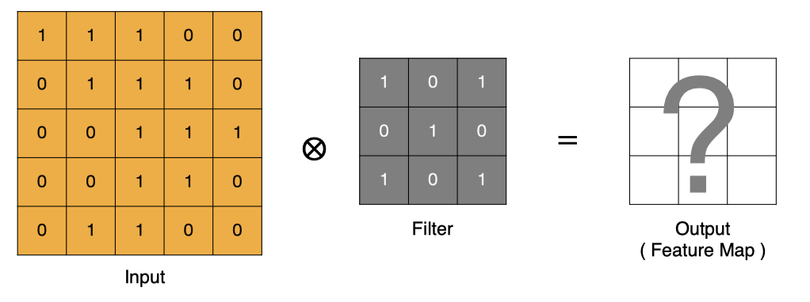

# 卷积神经网络CNN
## 图像基础知识

在计算机中，按照颜色和灰度的多少可以将图像分为四种基本类型。
| 图像类型     | 通道数           | 像素值范围       | 主要特点                                 | 常见用途                         |
  | ------------ | ---------------- | ---------------- | ---------------------------------------- | -------------------------------- |
  | **二值图像** | 1通道            | 0 或 1           | 每个像素只有黑与白两种值                 | 形态学操作、二值化、轮廓检测     |
  | **灰度图像** | 1通道            | 0 到 255         | 每个像素表示灰度（亮度）                 | 图像预处理、物体检测、人脸识别   |
  | **索引图像** | 1通道            | 0 到 255（索引） | 像素值为颜色表的索引，颜色表决定实际颜色 | 存储压缩、较少颜色的图像表示     |
  | **RGB图像**  | 3通道（R、G、B） | 0 到 255         | 每个像素由红、绿、蓝三个通道组成         | 普通彩色图像显示、图像处理与分析 |

   简单的讲：**图像是由像素点组成的，每个像素点的取值范围为: [0, 255] 。像素值越接近于0，颜色越暗，接近于黑色；像素值越接近于255，颜色越亮，接近于白色。**

### 图像加载

```python
import numpy as np
import matplotlib.pyplot as plt

# 读取图像
img = plt.imread("data/img.jpg")
# 保存图像
plt.imsave("data/img1.jpg", img)
# 展示图像
plt.imshow(img)
plt.axis("off")
plt.show()
```
## 卷积神经网络（CNN）概述
卷积神经网络（Convolutional Neural Network）是**含有卷积层的神经网络**。卷积层的**作用就是用来自动学习、提取图像的特征**。

CNN网络主要由三部分构成：**卷积层、池化层和全连接层**构成：

（1）卷积层负责提取图像中的局部特征  
（2）池化层用来大幅降低参数量级(降维)  
（3）全连接层类似人工神经网络的部分，用来输出想要的结果  

- 数据输入层：对数据做一些处理，比如去均值（各维度都减对应维度的均值，使得输入数据各个维度都中心化为0，避免数据过多偏差，影响训练效果）、归一化（把所有的数据都归一到同样的范围）、PCA等等。CNN只对训练集做“去均值”这一步。

- 卷积层(CONV)：线性乘积求和，提取图像中的局部特征
- 激励层(RELU)：ReLU激活函数,输入数据转换成输出数据
- 池化层(POOL)：取区域平均值或最大值，大幅降低参数量级(降维)

- 全连接层(FC)：接收二维数据集，输出CNN模型预测结果

##  卷积层

卷积层（Convolutional Layer）通过卷积操作提取输入数据中的特征（例如图像中的边缘、纹理、形状等）。  
卷积层利用卷积核（滤波器）对输入进行处理，从而生成特征图（feature map），并且每个卷积层能够提取不同层次的特征，从低级特征（如边缘）到高级特征（如物体的形状）。

> **卷积层的主要作用如下：**
>
> - **特征提取**：卷积层的主要作用是从输入图像中提取低级特征（如边缘、角点、纹理等）。通过多个卷积层的堆叠，网络能够逐渐从低级特征到高级特征（如物体的形状、区域等）进行学习。
>
> - **权重共享**：在卷积层中，同一个卷积核在整个输入图像上共享权重，这使得卷积层的参数数量大大减少，减少了计算量并提高了训练效率。
>
> - **局部连接**：卷积层中的每个神经元仅与输入图像的一个小局部区域相连，这称为**局部感受野**，这种局部连接方式更符合图像的空间结构，有助于捕捉图像中的局部特征。
>
> - **空间不变性**：由于卷积操作是局部的并且采用权重共享，卷积层在处理图像时具有**平移不变性**。也就是说，不论物体出现在图像的哪个位置，卷积层都能有效地检测到这些物体的特征。

### 卷积计算



1. input 表示输入的图像
2. filter 表示卷积核, 也叫做滤波器(滤波矩阵)
   - 一组固定的权重，因为每个神经元的多个权重固定，所以又可以看做一个恒定的滤波器filter
   - 非严格意义上来讲，下图中红框框起来的部分便可以理解为一个滤波器，即带着**一组固定权重的神经元**。多个滤波器叠加便成了卷积层
   - 一个卷积核就是一个神经元
3. input 经过 filter 得到输出为最右侧的图像，该图叫做特征图

**卷积运算本质上就是在滤波器和输入数据的局部区域间做点积。**

### Padding（填充）

通过上面的卷积计算过程，最终的特征图比原始图像小很多，如果想要保持经过卷积后的图像大小不变, 可以在**原图周围**添加 Padding 来实现。

Padding（填充）操作是一种用于处理卷积时图像边缘的像素，在输入特征图的边界周围添加额外像素（通常是零）。

**Padding的主要作用：**
>- **保持空间维度：** 如果不使用 padding，每次卷积操作后，特征图的尺寸都会缩小。多次卷积后，特征图会变得非常小，可能会丢失重要的边缘信息。Padding可以帮助维持输出特征图的尺寸与输入相同或接近相同。
>- **保留边缘信息：** 图像边缘的像素在卷积过程中参与的计算次数较少，这意味着边缘信息在特征提取过程中容易丢失。Padding通过在边缘添加额外的像素，增加了边缘像素的参与度，从而更好地保留了边缘信息。
>- **提高性能：** Padding有助于避免由于特征图尺寸快速缩小而导致的信息丢失，从而提高模型的性能，尤其是在处理较小的图像或需要进行多层卷积时。

**Padding的类型：**

- **Valid Padding (No Padding):** 不进行任何填充。卷积核只在输入图像的有效区域内滑动。输出尺寸会缩小。 
- **Same Padding:** 添加足够的填充，使得输出特征图的尺寸与输入相同。 
- **Full Padding:** 尽可能多地添加填充，使得卷积核的每个元素都至少在输入图像上滑动一次。输出尺寸会增大。

**Padding的选择：** 取决于具体的应用场景和网络架构

- **Valid Padding:** 适用于不需要保持输出尺寸的场景，或者输入图像足够大，边缘信息丢失不重要的情况。
- **Same Padding:** 广泛应用于各种CNN架构中，因为它可以保持特征图的尺寸，方便网络设计和计算。
- **Full Padding:** 较少使用，因为它会增加计算量，并且可能会在边缘引入一些伪影。

### Stride（步长）

Stride（步长）指的是**卷积核在图像上滑动时的步伐大小**，即每次卷积时卷积核在图像中向右（或向下）移动的像素数。步长直接影响卷积操作后输出特征图的尺寸，以及计算量和模型的特征提取能力。

**Stride的作用:**
>- **降低计算复杂度：** 更大的步长意味着卷积核移动的次数更少，从而减少了计算量，并加快了训练和推理速度。
>- **步长越大，生成的特征图尺寸越小。** 这类似于池化的降维效果。
>- **增大感受野：** 虽然更大的步长会减小特征图的尺寸，但它同时也会增大每个神经元在输入数据上的感受野。这意味着每个神经元能够捕捉到更大范围的输入信息。

**Stride的选择：** 取决于具体的应用场景和网络架构

- **`Stride = 1`:** 这是最常见的设置，尤其是在网络的早期层。它允许保留更多的空间细节。
- **`Stride > 1`:** 通常用于减小特征图的尺寸和增大感受野，例如在网络的后期层或需要进行快速降维时。 常见的设置包括 `stride=2` 或 `stride=4`。

###  多通道卷积计算

1. 当输入有多个通道(Channel), 例如 RGB 三个通道, 此时要求卷积核需要拥有**相同的通道数（图像有多少通道，每个卷积核就有多少通道）**.
2. 每个卷积核通道与对应的输入图像的**各个通道进行卷积**.
3. 将每个通道的卷积结果**按位相加**得到最终的特征图.

**先对应通道做点乘，然后做加法，然后整体做加法**

### 多卷积核卷积计算

实际对图像进行特征提取时, 我们需要使用多个卷积核进行特征提取. 这个多个卷积核可以理解为从不同到的视角、不同的角度对图像特征进行提取.


- 两个神经元，意味着有两个滤波器，有是两个不同的输出

### 特征图大小

输出特征图的大小与以下参数息息相关:

1. size: 卷积核/过滤器大小，一般会选择为奇数，比如有 `1*1`, `3*3`， `5*5`
2. Padding: 零填充的方式 
3. Stride: 步长

那计算方法如下图所示:

1. 输入图像大小: W x W
2. 卷积核大小: F x F
3. Stride: S
4. Padding: P
5. 输出图像大小: N x N

$$N = \frac{W - F + 2P}{S} + 1$$

以下图为例:
1. 图像大小: 5 x 5
2. 卷积核大小: 3 x 3
3. Stride: 1
4. Padding: 1
5. (5 - 3 + 2) / 1 + 1 = 5（如果除不尽向下取整）, 即得到的特征图大小为: 5 x 5

若原图大小为 W x A ,则将 W 和 A 分别代入计算。

###  卷积层API

在PyTorch中进行卷积的API是：

```python
conv = nn.Conv2d(in_channels, out_channels, kernel_size, stride, padding)

"""
参数说明：
in_channels: 输入通道数，RGB图片一般是3
out_channels: 输出通道，也可以理解为卷积核kernel的数量
kernel_size：卷积核的高和宽设置，一般为3,5,7...
stride：卷积核移动的步长
    整数stride：表示在所有维度上使用相同的步长 stride=2 表示在水平和垂直方向上每次移动2个像素
    元组stride: 允许在不同维度上设置不同的步长 stride=(2, 1) 表示在水平方向上步长为2，在垂直方向上步长为1
padding：在四周加入padding的数量，默认补0
    padding=0：不进行填充。
    padding=1：在每个维度上填充 1 个像素（常用于保持输出尺寸与输入相同 padding=输入形状大小-输出形状大小）。
    padding='same'（从 PyTorch 1.9+ 开始支持）：让输出特征图的尺寸与输入保持一致。PyTorch会自动计算需要的填充量。stride必须等于1，不支持跨行，因为计算padding时可能出现小数
    padding=kernel_size-1：Full Padding 完全填充
"""
```

## 池化层
池化层（Pooling Layer）是用于**降低输入数据的空间维度（例如图像的高度和宽度），从而减少计算量、减少内存消耗，并提高模型的鲁棒性**。  
池化层通常位于卷积层之后，它通过对卷积层输出的特征图进行下采样，保留最重要的特征信息，同时丢弃一些不重要的细节。

**池化层的主要作用如下:**

> - **降维和计算量减少**：池化层通过减少特征图的尺寸，从而降低了计算量，特别是在多层网络中，随着层数的增加，池化能够显著减少计算资源的消耗。
> - **提高鲁棒性**：池化操作可以使得特征对小的变换、平移和旋转变得更加不敏感。这样，模型在面对噪声或图像的轻微变化时，依然能够稳定工作。
> - **防止过拟合**：通过池化减少了特征图的大小，减少了模型的复杂度，从而有助于防止过拟合，尤其是在较小的数据集上。
> - **抽象特征**：通过池化层的操作，可以提取更为抽象和高层次的特征，使得网络能够学习到更具泛化能力的表示。

### 池化层计算

- 最大池化(Max Pooling) ：通过池化窗口进行最大池化，**取窗口中的最大值作为输出**
- 平均池化(Avg Pooling) ：**取窗口内的所有值的均值作为输出**

### Padding（填充）
同卷积层一样，池化层也可以设置填充。填充的方式与卷积层相同，即填充零。

### Stride（步长）
同卷积层一样，池化层也可以设置步长。

### 多通道池化计算

在处理多通道输入数据时，池化层对每个输入通道分别池化，而不是像卷积层那样将各个通道的输入相加。这意味着 **池化层的输出和输入的通道数是相等。**

**池化只在宽高维度上池化**，**在通道上是不发生池化**（池化前后，多少个通道还是多少个通道）

### 池化层API

```python
# 最大池化
nn.MaxPool2d(kernel_size=2, stride=2, padding=1)
# 平均池化
nn.AvgPool2d(kernel_size=2, stride=1, padding=0)
"""
参数说明：
kernel_size：核的高和宽设置，一般为3,5,7...
stride：核移动的步长
padding：在四周加入padding的数量，默认补0
"""
```

