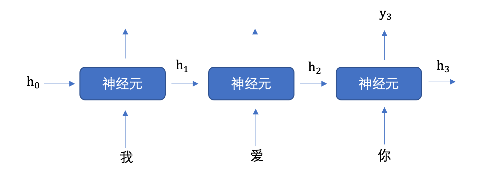

# 循环神经网络RNN

## 1. RNN介绍
循环神经网络（Recurrent Neural Network, RNN）是一种**专门处理序列数据的神经网络**。与传统的前馈神经网络不同，RNN具有“**循环**”结构，能够处理和记住前面时间步的信息，使其特别适用于时间序列数据或有时序依赖的任务。

时间序列数据是指在不同时间点上收集到的数据，这类数据反映了某一事物、现象等随时间的变化状态或程度。这是时间序列数据的定义，当然这里也可以不是时间，比如文字序列，但总归序列数据有一个特点——**后面的数据跟前面的数据有关系**。

### RNN应用场景
- **自然语言处理（NLP）**：文本生成、语言建模、机器翻译、情感分析等。
- **时间序列预测**：股市预测、气象预测、传感器数据分析等。
- **语音识别**：将语音信号转换为文字。
- **音乐生成**：通过学习音乐的时序模式来生成新乐曲。

### 自然语言处理概述
自然语言处理（Nature language Processing, NLP）研究的主要是**通过计算机算法来理解自然语言**。

$$h_t = \sigma(Wh_{t-1}+Vx_t+b_h)$$

$$y_t = \sigma(Uh_{t}+b_y)$$

$h_{t-1}$ 上一时刻的隐藏状态向量，$h_t$ 是当前时刻的隐藏状态向量。  
$x_t$ 是当前时刻输入向量，$y_t$ 是输出向量。  
$W$ $V$ $U$是权重矩阵。  
$\sigma$ 是激活函数。  
$b_h$ 是隐藏状态的偏置项，$b_y$ 是输出的偏置项。

NLP涵盖了从文本到语音、从语音到文本的各个方面，它涉及多种技术，包括语法分析、语义理解、情感分析、机器翻译等。

## 2. 词嵌入层

> 在 **RNN（Recurrent Neural Network）** 中，**词嵌入层（Word Embedding Layer）** 是处理自然语言数据的关键组成部分。它将输入的离散单词（通常是词汇表中的索引）转换为连续的、低维的向量表示，从而使得神经网络能够理解和处理这些词汇的语义信息。

### 词嵌入层作用

词嵌入层的主要目的是**将每个词映射为一个固定长度的向量（将文本转换为向量）**，这些向量能够捕捉词与词之间的语义关系。

传统的文本表示方法（如one-hot编码）无法反映单词之间的相似性，因为在one-hot编码中，每个单词都被表示为一个**高维稀疏向量**，而词嵌入通过**低维稠密向量**表示单词，能够更好地捕捉词汇之间的语义相似性。

词嵌入层首先会根据输入的词的数量构建一个**词向量矩阵**，例如: 我们有 100 个词，每个词希望转换成 128 维度的向量，那么构建的矩阵形状即为: 100*128，输入的每个词都对应了一个该矩阵中的一个向量。

**词嵌入层在RNN中的作用**：

- **输入表示**：通过词嵌入层将每个单词转换为一个固定长度的稠密向量。这些向量作为RNN的输入，帮助RNN理解词语的语义。
- **降低维度**：词嵌入层将原本高维的稀疏表示（如one-hot编码）转化为低维的稠密向量，减少了计算量，同时保持了词汇之间的语义关系。
- **捕捉语义相似性**：通过训练，词嵌入能够学习到词语之间的关系。

###  词嵌入层工作流程

- **初始化词向量**：词嵌入层的初始词向量通常会使用随机初始化或者通过加载预训练的词向量（如`Word2Vec`或`GloVe`）进行初始化。

- **输入索引**：每个单词在词汇表中都有一个唯一的索引。输入文本（例如一个句子）会先被分词，然后每个单词会被转换为相应的索引。

- **查找词向量**：词嵌入层将这些单词 **索引** 映射为对应的 **词向量** 。这些词向量是一个低维稠密向量，表示该词的语义。

- **输入到RNN**：这些 **词向量** 作为RNN的输入，RNN处理它们并根据上下文生成一个序列的输出。

### 词嵌入层使用

在PyTorch中，我们可以**使用 nn.Embedding 词嵌入层来实现输入词的向量化**。

`nn.Embedding` 对象构建时，最主要有两个参数:
- num_embeddings：表示**词的数量**
- embedding_dim：表示**用多少维的向量来表示每个词**

```python
nn.Embedding(num_embeddings=10, embedding_dim=4)
```

接下来，我们将会学习如何将词转换为词向量，其步骤如下:

1. 先将语料进行分词，构建词与索引的映射，我们可以把这个映射叫做**词表**，词表中每个词都对应了一个唯一的索引；
2. 然后使用 `nn.Embedding` 构建词嵌入矩阵，词索引对应的向量即为该词对应的数值化后的向量表示。

例如，我们的文本数据为: "北京冬奥的进度条已经过半，不少外国运动员在完成自己的比赛后踏上归途。"，接下来，我们看下如何使用词嵌入层将其进行转换为向量表示，步骤如下：

```python
import torch
import torch.nn as nn
import jieba # pip install jieba -i https://pypi.mirrors.ustc.edu.cn/simple/

# 0.文本数据
text = '北京冬奥的进度条已经过半，不少外国运动员在成自己的比赛后踏上归途。'
# 1. 文本分词
words = jieba.lcut(text)
# 2.分词去重并保留原来的顺序获取所有的词语
unique_words = list(set(words))
# 3. 构建词嵌入层
# num_embeddings: 表示词的总数量
# embedding_dim: 表示词嵌入的维度
embed = nn.Embedding(num_embeddings=le(unique_words), embedding_dim=4)
# 4. 词语的词向量表示
for i, word in enumerate(unique_words):
    # 获得词嵌入向量
    word_vector = embedding(torch.tensor([i])) 
```
## 3. 循环网络层
文本数据是具有序列特性的，

为了表示出数据的序列关系，我们需要使用循环神经网络(Recurrent Nearal Networks, RNN) 来对数据进行建模，RNN 是一个具有记忆功能的网络，它作用于处理带有序列特点的样本数据。

###  RNN网络层原理

当我们希望使用循环网络来对 "我爱你" 进行语义提取时，RNN计算过程是什么样的呢？



上图中h表示**隐藏状态**，隐藏状态保存了**序列数据中的历史信息**，并将这些信息传递给下一个时间步，从而允许RNN处理和预测序列数据中的元素。

每一次的输入都会包含两个值：**上一个时间步的隐藏状态、当前状态的输入值x**

每一次的输出都会包含两个值：**输出当前时间步的隐藏状态、当前时间步的预测结果y**

**隐藏状态作用：**

- **记忆功能**：隐藏状态就像RNN的记忆，它能够在不同的时间步之间传递信息。当一个新的输入进入网络时，当前的隐藏状态会结合这个新输入来生成新的隐藏状态。

- **上下文理解**：由于隐藏状态携带了过去的信息，它可以用于理解和生成与上下文相关的输出。这对于语言模型、机器翻译等任务尤其重要。

- **连接不同时间步**：隐藏状态通过网络内部的循环连接将各个时间步连接起来，使得网络可以处理变长的序列数据。

上图中，为了更加容易理解，虽然画了 3 个神经元, 但是实际上只有一个神经元，"我爱你" 三个字是重复输入到同一个神经元中。

首先初始化出第一个隐藏状态，一般都是全0的一个向量，然后将 "我" 进行词嵌入，转换为向量的表示形式，送入到第一个时间步，然后输出隐藏状态 h1，然后将 h1 和 "爱" 输入到第二个时间步，得到隐藏状态 h2, 将 h2 送入到全连接网络，得到 "你" 的预测概率。

**RNN神经元内部是如何计算的呢？**

**1. 计算隐藏状态：** 每个时间步的隐藏状态 $h_t$ 是根据当前输入 $x_t$ 和前一时刻的隐藏状态 $h_{t-1}$ 计算的。
$$h_t = \tanh(W_{ih}x_t + b_{ih} + W_{hh}h_{t-1} + b_{hh})$$
上述公式中:
- $W_{ih}$ 表示输入数据的权重
- $b_{ih}​$ 表示输入数据的偏置
- $W_{hh}​$ 表示输入隐藏状态的权重
- $b_{hh}$ 表示输入隐藏状态的偏置
- $h_{t-1}$ 表示输入隐藏状态
- $h_t​$ 表示输出隐藏状态

最后对输出的结果使用tanh激活函数进行计算，得到该神经元你的输出隐藏状态。

**2. 计算当前时刻的输出：** 网络的输出 $y_t$ 是当前时刻的隐藏状态经过一个线性变换得到的。
$$y_t=W_{hy}h_t+b_y​$$
- $y_t​$ 是当前时刻的输出（通常是一个向量，表示当前时刻的预测值，RNN层的预测值）
- $h_t​$ 是当前时刻的隐藏状态
- $W_{hy}$ 是从隐藏状态到输出的权重矩阵
- $b_y$ 是输出层的偏置项

**3. 词汇表映射**：输出 $y_t$ 是一个**向量**，该向量经过**全连接层**后输出得到最终预测结果 $y_{pred}$，$y_{pred}$中每个元素代表当前时刻生成词汇表中某个词的得分（或概率，通过激活函数：如**softmax**）。词汇表有多少个词，$y_{pred}$就有多少个元素值，**最大元素值对应的词就是当前时刻预测生成的词**。

**神经元工作机制总结：**

- **接收输入**：每个RNN神经元接收来自输入数据$x_t$和前一时刻的隐藏状态$h_{t-1}$。

- **更新隐藏状态**：神经元通过一个加权和（由权重矩阵和偏置项组成）更新当前时刻的隐藏状态$h_t​$，该隐藏状态包含了来自过去的记忆以及当前输入的信息。

- **输出计算**：基于当前隐藏状态$h_t​$，神经元生成当前时刻的输出$y_t​$，该输出可以用于任务的最终预测。

**文本生成示例：**

假设我们使用RNN进行**文本生成**，输入是一个初始词语或一段上下文。RNN会通过隐藏状态逐步生成下一个词的概率分布，然后根据概率选择最可能的下一个词。

1. 输入：“m” → 词向量输入 $x_1$（对应“m”）
2. 初始化隐藏状态 $h_0​$，一般初始值为0
3. 隐藏状态更新 $h_1​$，并计算输出 $y_1​$
4. 经过全连接层输出层计算输出 $y_{pred}​$，使用softmax函数将 $y_{pred}​$转换为概率分布
5. 选择概率最高的词作为输出词（例如“a”）
6. 输入新的词“a”，继续处理下一个时间步，直到生成完整的词或句子

**小结：** 在循环神经网络中，**词与输出的对应关系**通常通过以下几个步骤建立

1. **词嵌入**：将词转化为向量表示（词向量）。
2. **RNN处理**：通过RNN层逐步处理词向量，生成每个时间步的隐藏状态。
3. **输出映射**：通过线性变换将隐藏状态映射到输出，通常是一个词汇表中的词的概率分布。

###  RNN层的使用
  ```python
  RNN = nn.RNN(input_size, hidden_size，num_layers)
  ```

  参数意义是：
  - input_size：输入数据的维度，一般设为词向量的维度
  - hidden_size：隐藏层h的维度，也是当前层神经元的输出维度
  - num_layers: 隐藏层h的层数，默认为1

- 输入数据和输出结果

  将RNN实例化就可以将数据送入其中进行处理，处理的方式如下所示：

  ```python
  output, hn = RNN(x, h0)
  ```

  - **输入数据：主要包括词嵌入的x 、初始的隐藏层h0**
    - x的表示形式为[seq_len, batch, input_size]，即[句子的长度，batch的大小，词向量的维度]
    - h0的表示形式为[num_layers, batch, hidden_size]，即[隐藏层的层数，batch的大小，隐藏层h的维度]
  - **输出结果：主要包括输出结果output,最后一层的hn**
    - output的表示形式与输入x类似，为[seq_len, batch, input_size]，即[句子的长度，batch的大小，输出向量的维度]
    - hn的表示形式与输入h0一样，为[num_layers, batch, hidden_size]，即[隐藏层的层数，batch的大，隐藏层h的维度]

```python
# 词向量维度 128, 隐藏向量维度 256
rnn = nn.RNN(input_size=128, hidden_size=256)
# 第一个数字: 表示句子长度,也就是词语个数
# 第二个数字: 批量个数，也就是句子的个数
# 第三个数字: 词向量维度
inputs = torch.randn(5, 32, 128)
hn = torch.zeros(1, 32, 256)
# 获取输出结果
output, hn = rnn(inputs, hn)
```
