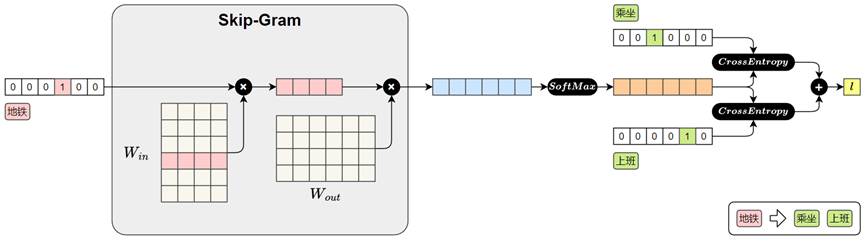
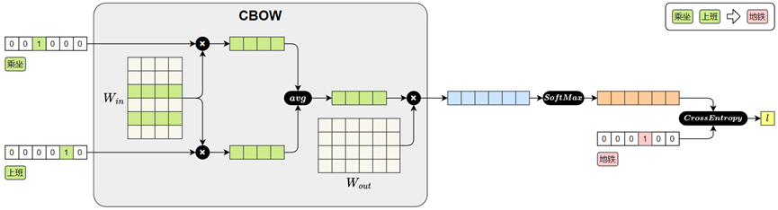

# 文本表示
文本表示是将自然语言转化为计算机能够理解的数值形式，是绝大多数自然语言处理（NLP）任务的基础步骤。

文本表示的第一步通常是分词和词表构建
- **分词(Tokenization)** 是将原始文本切分为若干具有独立语义的最小单元（即token）的过程，是所有 NLP 任务的起点。
- **词表(Vocabulary)** 是由语料库构建出的、包含模型可识别 token 的集合。词表中每个token都分配有唯一的 ID，并支持 **token 与 ID 之间的双向映射**。

在后续训练或预测过程中，模型会首先对输入文本进行分词，再通过词表将每个 token 映射为其对应的 ID。接着，这些 ID 会被输入**嵌入层**（Embedding Layer），转换为低维稠密的向量表示（即词向量）.

## 分词
### 英文分词
按照分词粒度的大小，可分为词级（Word-Level）分词、字符级（Character Level）分词和子词级（Subword‑Level）分词。

#### 词级分词
将文本 **按词语进行切分**，是最传统、最直观的分词方式。在英文中，空格和标点往往是天然的分隔符。

实际应用中容易出现 OOV（Out Of Vocabulary，未登录词）问题, 在模型使用阶段，输入文本中出现了不在预先构建词表中的词语，常见的包括网络热词、专有名词、复合词及拼写变体等。由于模型无法识别这些词，通常会将其统一替换为特殊标记（如 `<UNK>`），从而导致语义信息的丢失，影响模型的理解与预测能力。

#### 字符级分词
以单个字符为最小单位进行分词的方法，文本中的每一个字母、数字、标点甚至空格，都会被视作一个独立的 token。  

几乎不存在 OOV（Out-of-Vocabulary）问题。无论输入中出现什么样的新词或拼写变体，只要字符在词表中，都能被表示出来。

单个字符本身语义信息极弱，模型必须依赖更长的上下文来推断词义和结构，增加了建模难度和训练成本.  
输入序列更长，影响模型效率。

#### 子词级分词
一种介于词级分词与字符级分词之间的分词方法，它将词语切分为更小的单元——子词（subword），例如词根、前缀、后缀或常见词片段。与词级分词相比，子词分词可以显著缓解OOV问题；与字符级分词相比，它能更好地保留一定的语义结构。

常见的子词分词算法包括 BPE（Byte Pair Encoding）、WordPiece 和 Unigram Language Model。

### 中文分词
#### 字符级分词
字符级分词是中文处理中最简单的一种方式，即将文本按照单个汉字进行切分，文本中的每一个汉字都被视为一个独立的 token。

#### 词级分词
词级分词是将中文文本按照完整词语进行切分的传统方法，切分结果更贴近人类阅读习惯。

#### 子词分词算法
虽然中文没有英文中的子词结构（如前缀、后缀、词根等），但子词分词算法（如 BPE）仍可直接应用于中文。它们以汉字为基本单位，通过学习语料中高频的字组合（如“自然”、“语言”、“处理”），自动构建子词词表。这种方式无需人工词典，具有较强的适应能力。

在当前主流的中文大模型（如通义千问、DeepSeek）中，子词分词已成为广泛采用的文本切分策略。

### 分词工具
- **基于词典或模型的传统方法**  
代表工具包括 jieba、HanLP等，这些工具广泛应用于传统 NLP 任务中。
- **基于子词建模算法（如BPE）的方式**，从数据中自动学习高频字组合，构建子词词表.  
代表工具包括 Hugging Face Tokenizer、SentencePiece、tiktoken等，常用于大规模预训练语言模型中。

#### jieba分词器
jieba 是中文分词领域中应用广泛的开源工具之一，具有接口简洁、模式灵活、词典可扩展等特点，在各类传统 NLP 任务中依然具备良好的实用价值。

jieba分词器提供了多种分词模式，以适应不同的应用场景。

1. **精确模式（默认）**

`jieba.cut`或者`jieba.lcut`方法，前者返回一个生成器对象，后者返回一个list。
```python
words_generator = jieba.cut(text)  # 返回一个生成器
words_list = jieba.lcut(text)  # 返回一个列表
```

2. **全模式**

使用`jieba.cut`或者`jieba.lcut`，并将`cut_all`参数设置为`True`
```python
words_generator = jieba.cut(text, cut_all=True)  # 返回一个生成器
words_list = jieba.lcut(text, cut_all=True)  # 返回一个列表
```

3. **搜索引擎模式**

在精确模式基础上，对长词进一步切分，适合用于搜索引擎分词。使用`jieba.cut_for_search`或者`jieba.lcut_for_search`
```python
words_generator = jieba.cut_for_search(text)  # 返回一个生成器
words_list = jieba.lcut_for_search(text)  # 返回一个列表
```

4. **自定义词典**

自定义词典的格式为：一个词占一行，每一行分三部分：

**词语**、**词频**（可省略，词频决定某个词在分词时的优先级。词频越高被优先切分出来的概率越大）、**词性标签**（可省略，不影响分词结果），用空格隔开，顺序不可颠倒。例如
```text
云计算
云原生 5
大模型 10 n
```

可使用`jieba.load_userdict(file_name)`加载词典文件，也可以使用`jieba.add_word(word, freq=None, tag=None)`与`jieba.del_word(word)`动态修改词典。

## 词表示
分词完成之后，文本被转换为一系列的 token（词、子词或字符）。为了让模型能够理解和处理文本，必须将这些 token 转换为计算机可以识别和操作的数值形式，这一步就是所谓的词表示（word representation）。

### One-hot编码
最早期的词向量表示方式是 One-hot 编码：它将词汇表中的每个词映射为一个稀疏向量，向量的长度等于整个词表的大小。该词在对应的位置为 1，其他位置为 0。

实现简单、直观易懂，但它无法体现词与词之间的语义关系，且随着词表规模的扩大，向量维度会迅速膨胀，导致计算效率低下。

### 语义化词向量

Word2Vec模型，它通过对大规模语料的学习，为每个词生成一个具有语义意义的稠密向量表示。这些向量能够在连续空间中表达词与词之间的关系，使得“意思相近”的词在空间中距离更近。
#### Word2Vec概述
Word2Vec的设计理念源自 “**分布假设**” ——即一个词的含义由它周围的词决定。

Word2Vec构建了一个简洁的神经网络模型，通过学习词与上下文之间的关系，自动为每个词生成一个能够反映语义特征的向量表示。

Word2Vec提供了两种典型的模型结构:
- **CBOW（Continuous Bag-of-Words）模型**  
输入是一个词的上下文（即前后若干个词），模型的目标是预测中间的目标词。

- **Skip-gram 模型**  
输入是一个中心词，模型的目标是预测其上下文中的所有词（即前后若干个词）。

#### Word2Vec原理
Word2Vec 不依赖人工标注，而是直接利用大规模原始文本（如书籍、新闻、网页等）作为数据源，从中自动构造训练样本。  
由于两种模型的输入和输出都是词语，因此首先需要对原始文本进行分词，将连续文本转换为 token 序列。  
此外，模型无法直接处理文本符号，训练时仍需将词语转换为 one-hot 编码，以便作为模型的输入和输出进行计算。

**Skip-Gram**




前向传播过程如下：
1. **输入中心词（地铁）**  
“地铁”用 one-hot 向量表示
1. **查找词向量**($\mathbf{W}_{in}$)  
与参数矩阵 $\mathbf{W}_{in}$ 相乘，取出“地铁”对应的词向量。（ $\mathbf{W}_{in}$ 实际上就是词向量矩阵，每一行表示一个词的向量）
1. **预测上下文**  
将中心词向量与参数矩阵 $\mathbf{W}_{out}$ 相乘，得到对整个词表的预测得分。
1. **Softmax 输出**  
得分通过 Softmax 转为概率分布，表示各词作为上下文的可能性。
1. **计算损失**  
与真实上下文词“乘坐”、“上班”进行比对，计算交叉熵损失并求和，得到总损失。  

之后在进行反向传播时，参数矩阵 $\mathbf{W}_{in}$ 中的“地铁”对应的词向量就会被更新，模型通过这个过程不断的进行学习，最终便能得到具有语义的词向量。

**CBOW**



CBOW 模型的前向传播过程如下：
1. **输入上下文词（乘坐、上班）**  
每个词用 one-hot 向量表示。
2. **查找词向量**($\mathbf{W}_{in}$)  
   每个 one-hot 向量与参数矩阵 $\mathbf{W}_{in}$ 相乘，查出对应的词向量。（ $\mathbf{W}_{in}$ 实际上就是词向量矩阵，每一行表示一个词的向量）
3. **平均上下文向量**  
将多个上下文词向量取平均，得到一个整体的上下文表示。
4. **预测中心词**  
将平均后的上下文向量与参数矩阵$\mathbf{W}_{out}$相乘，得到对整个词表的预测得分。
5. **Softmax 输出**  
将得分输入Softmax，得到每个词作为中心词的概率分布。
6. **计算损失**  
将预测结果与真实中心词“地铁”的one-hot向量进行比对，计算交叉熵损失。

之后在进行反向传播时，参数矩阵 $\mathbf{W}_{in}$ 中“乘坐”和“上班”对应的词向量就会被更新。模型通过不断训练，逐步优化这些向量，最终便能得到具有语义的词向量。

#### 获取Word2Vec词向量
词向量的获取通常有两种方式：一种是直接使用他人公开发布的词向量，另一种是在特定语料上自行训练。

1. **直接使用公开的词向量**
```python
model_path = 'sgns.weibo.word.bz2'
model = KeyedVectors.load_word2vec_format(model_path)
```

2. **自行训练词向量**
```python
df = pd.read_csv('online_shopping_10_cats.csv', encoding='utf-8', usecols=['review'])

sentences = [[token for token in jieba.lcut(review) if token.strip() != ''] for review in df["review"]]

model = Word2Vec(
    sentences,  # 已分词的句子序列
    vector_size=100,  # 词向量维度
    window=5,  # 上下文窗口大小
    min_count=2,  # 最小词频（低于将被忽略）
    sg=1,  # 1 = Skip-Gram，0 = CBOW
    workers=4  # 并行训练线程数
)

model.wv.save_word2vec_format('my_vectors.kv')
my_model = KeyedVectors.load_word2vec_format('my_vectors.kv')
```

#### 应用Word2Vec词向量
在现代深度学习的 NLP 模型中，大多数任务的输入第一层都是**嵌入层**。本质上，嵌入层就是一个查找表（lookup table）：输入是词在**词汇表中的索引**；输出是**该词对应的向量表示**。

嵌入层的参数矩阵可以有两种典型的初始化方式：
- **随机初始化**  
模型训练开始时，嵌入向量是随机生成的，模型会通过反向传播逐步学习每个词的表示。

- **预训练初始化**
加载训练好的词向量（如 Word2Vec）到嵌入层中作为初始参数，这样可以为模型注入丰富的语言知识，尤其在低资源任务中优势明显。并且，加载预训练词向量后，可选择是否让嵌入层继续参与训练。

使用预训练词向量初始化Embedding层  `nn.Embedding.from_pretrained`

```python
# 1. 加载预训练的 Word2Vec 模型
word_vectors = KeyedVectors.load_word2vec_format("my_vectors.kv")

# 2. 构建词表和词向量矩阵
word2index = word_vectors.key_to_index  # 词到索引的映射
embedding_dim = word_vectors.vector_size  # 词语向量维度
num_embeddings = len(word2index)  # 词表大小

embedding_matrix = torch.zeros(num_embeddings, embedding_dim)  # 构造词向量矩阵,形状为(词表大小,词向量维度大小)
for word, idx in word2index.items():
    embedding_matrix[idx] = torch.tensor(word_vectors[word])

# 3. 构建 PyTorch 的嵌入层
embedding_layer = nn.Embedding.from_pretrained(
    embedding_matrix, # 词向量矩阵，形状为(num_embeddigns,embedding_dim)
    freeze=False  # 是否冻结词向量
)
```

### 上下文相关词表示
虽然像Word2Vec这样的模型已经能够为词语提供具有语义的向量表示，但是它只为每个词分配一个固定的向量表示，不论它在句中出现的语境如何。这种表示被称为静态词向量（static embeddings）。
然而，语言的表达极其灵活，一个词在不同上下文中可能有完全不同的含义。

上下文相关词表示（Contextual Word Representations），是指词语的向量表示会根据它所在的句子上下文动态变化，从而更好地捕捉其语义。一个具有代表性的模型是——ELMo。

该模型全称为 Embeddings from Language Models，发表于2018年2月。其基于LSTM 语言模型，使用上下文动态生成每个词的表示，每个词的向量由其前文和后文共同决定，是第一个被广泛应用于下游任务的上下文词向量模型。

