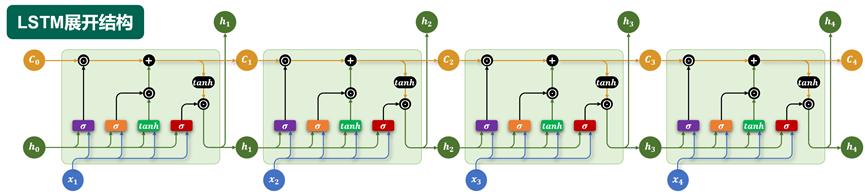

# LSTM

## 基础结构
LSTM 通过引入特殊的记忆单元，有效提升了模型对长序列依赖关系的建模能力。

其内部结构如下图所示，核心结构是三个“门”，分别是遗忘门、输入门和输出门。



- **记忆单元（Memory Cell）**  

记忆单元负责在序列中长期保存关键信息。它相当于一条“信息通道”，在多个时间步之间直接传递信息（记忆单元是缓解梯度消失和梯度爆炸问题的核心），即图中 $C_{t-1} \rightarrow C_t$ 。

- **遗忘门（Forget Gate）**  
  
遗忘门决定当前时间步要忘记多少过去的记忆。
遗忘门会根据上一个时间步的隐藏状态 $\bm{h}_{t-1}$ 和当前时间步的输入 $\bm{x}_t$, 生成一个0到1之间的控制系数，然后与上一个时间步的记忆单元状态 $C_{t-1}$ 相乘，从而动态调整哪些信息应该被遗忘。  
遗忘门的计算公式为：
$$\bm{f}_t = \sigma(\bm{h}_{t-1} \times \mathbf{W}_h^f + \bm{x}_t \times \mathbf{W}_x^f + \bm{b}_f)$$

图中的 $⊙$ 符号为阿达玛乘积（Hadamard product），表示逐元素相乘。

- **输入门（Input Gate）**  

输入门控制要从当前时间步的输入向记忆单元存入多少新的信息。例如上述案例中，当前时间步的输入为“小美”，所以此时记忆单元就应该存入新的主语信息“小美”。  

当前时间步的信息由当前输入 $\bm{x}_t$ 和上一个隐藏状态 $\bm{h}_{t-1}$ 计算而成，同时输入门也由当前输入 $\bm{x}_t$ 和上一个隐藏状态 $\bm{h}_{t-1}$ 计算而成，然后新的信息和输入门相乘得到需要存入记忆单元的信息. 

当前时间步的信息计算公式为：
$$\tilde{\bm{h}}_t = \tanh(\bm{h}_{t-1} \times \mathbf{W}_h + \bm{x}_t \times \mathbf{W}_x + \bm{b})$$

输入门的计算公式为：
$$\bm{i}_t = \sigma(\bm{h}_{t-1} \times \mathbf{W}_h^i + \bm{x}_t \times \mathbf{W}_x^i + \bm{b}_i)$$

综上所述可以得到记忆单元更新的完整公式为：
$$C_t = \bm{f}_t \odot C_{t-1} + \bm{i}_t \odot \tilde{\bm{h}}_t$$

- **输出门（Output Gate）**  
  
输出门控制从记忆单元中读取多少信息作为当前时间步的隐藏状态进行输出。输出门同样由当前输入 $\bm{x}_t$ 和上一个隐藏状态 $\bm{h}_{t-1}$ 计算而成。

输出门的计算公式为：
$$\bm{o}_t = \sigma(\bm{h}_{t-1} \times \mathbf{W}_h^o + \bm{x}_t \times \mathbf{W}_x^o + \bm{b}_o)$$

当前时间步输出的隐藏状态计算公式为：
$$\bm{h}_t = \bm{o}_t \odot \tanh(C_t)$$

LSTM通过引入记忆单元（Memory Cell），在时间步之间提供了一条稳定的梯度传播路径。整体衰减速度远小于传统RNN中隐藏状态链式传播时的指数衰减。这使得早期时间步的输入，能够通过记忆单元路径稳定地影响到最终的总梯度，从而有效参与参数的更新，保证了模型对长序列依赖的学习能力。

## 多层结构
与RNN类似，LSTM 也可以通过堆叠多个层来构建更深的网络，以增强模型对序列特征的建模能力。  
在多层 LSTM 中，每一层 LSTM 的输出隐藏状态，会作为下一层 LSTM 的输入，同时每一层都维护独立的记忆单元。通过层层传递和提取信息，多层结构能够捕捉更复杂、更抽象的时序特征。

## 双向结构
对于 LSTM，同样可以通过双向机制，利用序列中的过去信息和未来信息，进一步提升模型的建模能力。 
在双向 LSTM 中，使用两套独立的 LSTM 网络：  
- 正向 LSTM 按时间顺序处理输入序列；  
- 反向 LSTM 按逆时间顺序处理输入序列。

每个时间步同时得到两个隐藏状态，通常将它们进行拼接，形成最终的输出。  

## 多层+双向结构
对于LSTM而言，多层结构和双向结构也可组合使用，每层都是一个双向LSTM

## API使用
`torch.nn.LSTM`是 PyTorch 中实现长短期记忆网络（Long Short-Term Memory, LSTM）的模块。它用于对序列数据建模，在自然语言处理（NLP）、时间序列预测等任务中广泛使用。该模块支持单层或多层 LSTM，可选择是否使用双向结构（bidirectional）。
`torch.nn.LSTM`与`torch.nn.RNN`的API十分相似，主要区别在于相较于RNN，多了一个记忆单元需要处理。

```python
torch.nn.LSTM(
    input_size,         # 每个时间步输入特征的维度（词向量维度）
    hidden_size,        # 隐藏状态的维度
    num_layers=1,       # LSTM的层数
    bias=True,          # 是否使用偏置项
    batch_first=False,  # 输入和输出的格式，True表示输入和输出的维度顺序为(batch, seq, feature)，False表示输入和输出的维度顺序为(seq, batch, feature)
    dropout=0.0,        # 层之间的dropout概率
    bidirectional=False,    # 是否使用双向结构
    proj_size=0,    # 隐藏状态的投影输出维度；若为 0，则不使用 projection。
    device=None,    # 运行设备
    dtype=None      # 数据类型
    ) 
```

### 输入输出
```python
lstm = torch.nn.LSTM()
output, (h_n, c_n) = lstm(input, (h_0, c_0))
```
**输入**	
- `input` 输入序列  
  形状为`(seq_len, batch_size, input_size)`，如果 `batch_first=True`，则为 `(batch_size, seq_len, input_size)`
- `h_0` 可选  
  初始隐藏状态，形状为 `(num_layers × num_directions, batch_size, hidden_size)`
- `c_0` 可选  
  初始细胞状态，形状为` (num_layers × num_directions, batch_size, hidden_size)`

**输出**

- `output` LSTM层的输出
  包含最后一层每个时间步的隐藏状态，形状为 `(seq_len, batch_size, num_directions × hidden_size )`，如果如果 `batch_first=True`，则为`(batch_size, seq_len, num_directions × hidden_size )`
- `h_n ` 
  最后一个时间步的隐藏状态，包含每一层的每个方向，形状为 `(num_layers × num_directions, batch_size, hidden_size)`
- `c_n`  
  最后一个时间步的细胞状态，包含每一层的每个方向，形状为` (num_layers × num_directions, batch_size, hidden_size)`

## 存在问题
尽管 LSTM 相较传统 RNN 解决了长期依赖问题，性能大幅提升，但在实际应用中，仍存在一些明显的局限性和问题，主要包括：

- **难以并行计算**  
LSTM 的时间步之间具有强依赖性（后一个时间步的输入依赖前一个时间步的输出），导致无法进行大规模并行加速，训练和推理速度受限。

- **参数量大，计算开销高**  
每个 LSTM 单元内部包含多个门控机制（输入门、遗忘门、输出门），每个门都需要独立计算，导致参数数量和计算量远大于普通 RNN。
在资源受限的场景下（如移动端、嵌入式设备），部署 LSTM 会面临挑战。

- **长期依赖建模仍然有限**  
虽然 LSTM 延缓了梯度消失问题，但并不能完全消除。当序列极长时，模型依然难以有效捕捉非常远距离的依赖关系。

