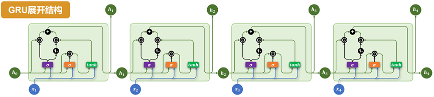

# GRU
Gated Recurrent Unit（GRU）是为了进一步简化 LSTM 结构、降低计算成本而提出的一种变体。GRU 保留了门控机制的核心思想，但相比 LSTM，结构更为简洁，参数更少，训练效率更高。
在许多实际任务中，GRU 能在保持类似性能的同时，显著减少训练时间。
## 基础结构
与LSTM相比，GRU做出了以下改进：
- 取消了LSTM中独立的记忆单元，只保留隐藏状态。
- 通过两个门控结构控制信息流动：**更新门**（Update Gate）和 **重置门**（Reset Gate）。

具体结构如下图所示：


各部分说明如下：
- **重置门（Reset Gate）**

重置门由上一个时间步的隐藏状态和当前时间步的输入计算得到：
$$\bm{r}_t = \sigma(\mathbf{W}_h^r \times \bm{h}_{t-1} + \bm{x}_t \times \mathbf{W}_x^r + \bm{b}_r)$$

重置门会在计算当前时间步信息（候选隐藏状态）时，作用在上一个时间步的隐藏状态，用于控制遗忘多少旧信息. 

当前时间步的信息（候选隐藏状态）的计算公式为：
$$\tilde{\bm{h}}_t = \tanh((\bm{r}_t \odot \bm{h}_{t-1})\times \mathbf{W}_h + \bm{x}_t \times \mathbf{W}_x + \bm{b})$$

- **更新门（Update Gate）**

更新门也由上一时间步的隐藏状态和当前时间步的输入计算得到
$$\bm{z}_t = \sigma(\bm{h}_{t-1} \times \mathbf{W}_h^z + \bm{x}_t \times \mathbf{W}_x^z + \bm{b}_z)$$

更新门会在计算当前时间步最终的隐藏状态 $\bm{h}_{t}$ 时，分别作用在上一时刻的隐藏状态 $\bm{h}_{t-1}$ 和当前新计算出的候选隐藏状态 $\tilde{\bm{h}}_t$，用于控制保留多少旧信息，以及引入多少新信息。

最终隐藏状态的计算公式为：
$$\bm{h}_t = \bm{z}_t \odot \bm{h}_{t-1} + (\bm{1} - \bm{z}_t) \odot \tilde{\bm{h}}_t$$

## 多层结构
GRU同样支持多层结构
## 双向结构
GRU同样支持双向结构
## 多层+双向结构
GRU同样支持多层结构和双向结构
## API使用
`torch.nn.GRU` 是 PyTorch 中实现门控循环单元（Gated Recurrent Unit, GRU）的模块。它用于对序列数据建模，在自然语言处理（NLP）、时间序列预测等任务中广泛使用。该模块支持单层或多层 GRU，可选择是否使用双向结构（bidirectional）。
`torch.nn.GRU`与`torch.nn.RNN`的API几乎完全相同。 

```python
torch.nn.GRU(
    input_size,             # 每个时间步输入特征的维度（词向量维度）
    hidden_size,            # 隐藏状态的维度
    num_layers=1,           # GRU的层数
    bias=True,              # 是否使用偏置
    batch_first=False,      # 输入和输出的格式，True为[batch, seq, feature]，False为[seq, batch, feature]
    dropout=0.0,            # 层之间的dropout
    bidirectional=False,    # 是否使用双向结构
    device=None,            # 设备
    dtype=None              # 数据类型
    )
```

### 输入输出
```python
gru= torch.nn.GRU()
output, h_n = gru(input, h_0)
```

**输入**	
- `input` 输入序列  
  形状为`(seq_len, batch_size, input_size)`，如果 `batch_first=True`，则为 `(batch_size, seq_len, input_size)`
- `h_0` 可选  
  初始隐藏状态，形状为 `(num_layers × num_directions, batch_size, hidden_size)`

**输出**

- `output` GRU层的输出
  包含最后一层每个时间步的隐藏状态，形状为 `(seq_len, batch_size, num_directions × hidden_size )`，如果如果 `batch_first=True`，则为`(batch_size, seq_len, num_directions × hidden_size )`
- `h_n ` 
  最后一个时间步的隐藏状态，包含每一层的每个方向，形状为 `(num_layers × num_directions, batch_size, hidden_size)`


## 存在问题
GRU 在简化结构、提高训练效率方面表现优秀，但在超长依赖建模、灵活性和并行计算方面仍存在天然限制。